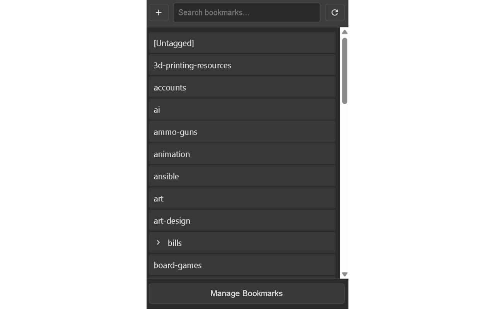
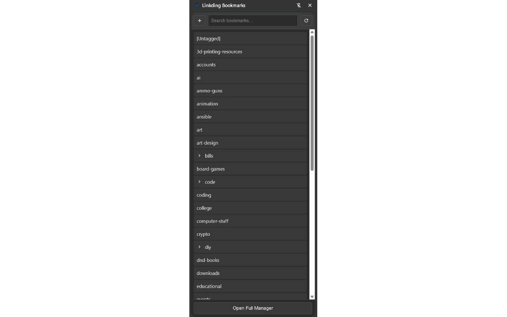
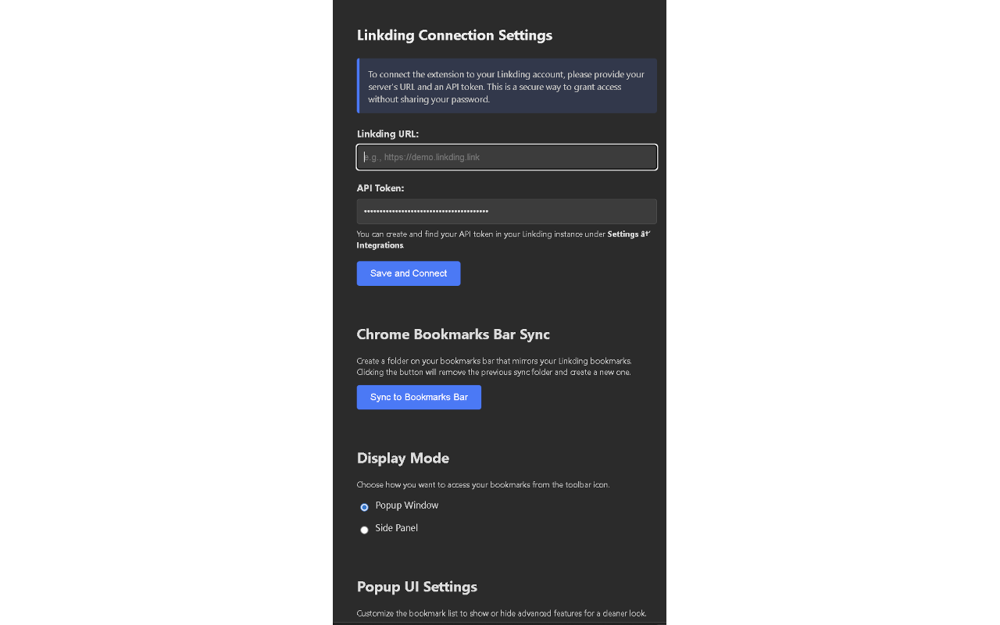

# Linkding Bookmarks Chrome Extension

A comprehensive browser extension for the self-hosted bookmarking service, [Linkding](https://github.com/sissbruecker/linkding). Access, manage, and add bookmarks directly from your browser's toolbar, side panel, or context menu.

This extension is built with performance and usability in mind, offering a fast, cached, and highly customizable interface to your bookmarks.

## Features

*   **Multiple Views**: Access your bookmarks in the way that suits you best.
    *   **Popup**: A compact, traditional dropdown from the toolbar icon.
    *   **Side Panel**: A persistent view in the browser's side panel, perfect for power users.
    *   **Manager Page**: A full-tab experience for advanced searching and management.
*   **Configurable Display Mode**: Choose whether the toolbar icon opens the Popup or the Side Panel from the options page.
*   **Nested Folder View**: Bookmarks are automatically organized into a collapsible folder tree based on their tags (e.g., a bookmark with the tag `dev.js` appears in a `js` folder inside a `dev` folder).
*   **Full CRUD & UX**:
    *   **Create**: Add bookmarks for the current tab or from any link on a page via the context menu.
    *   **Read**: Instantly search and filter all bookmarks.
    *   **Update**: Inline editing for title, URL, description, and tags, complete with tag autocompletion.
    *   **Delete**: Remove bookmarks with a single click.
*   **Drag & Drop**: Intuitively move bookmarks between folders (tags) by dragging them.
*   **Optimistic UI**: All actions (edit, delete, move) update the interface instantly without collapsing your folder structure, providing a seamless experience.
*   **Customizable UI**: Tailor the interface to your needs. Separately for the Popup and Side Panel, you can:
    *   Toggle the visibility of tags under each bookmark.
    *   Toggle the visibility of action buttons (Edit, Delete, Drag & Drop).
*   **Performance First**:
    *   All bookmarks are fetched and cached locally to provide an instant-loading experience.
    *   The cache is automatically invalidated when you make changes.
*   **Dark/Light Mode**: The UI automatically adapts to your system's color scheme preference.

## Screenshots

**Popup View:**


**Side Panel View:**


**Options Page:**


**Manager Page:**


## Installation

As this extension is not yet on the Chrome Web Store, you can install it from the source code.

1.  Download or clone this repository to your local machine.
    ```sh
    git clone <repository-url>
    ```
2.  Open your Chromium-based browser (Google Chrome, Microsoft Edge, Brave, etc.).
3.  Navigate to the extensions page. This is typically `chrome://extensions` or `edge://extensions`.
4.  Enable **"Developer mode"** using the toggle switch, usually found in the top-right corner.
5.  Click the **"Load unpacked"** button.
6.  Select the directory where you cloned or downloaded the extension's source code.
7.  The Linkding Bookmarks extension icon should now appear in your browser's toolbar.

## Configuration

Before you can use the extension, you need to connect it to your Linkding instance.

1.  Right-click the extension icon in your toolbar and select **"Options"**.
2.  In the **Connection Settings** section:
    *   Enter the full URL of your Linkding instance (e.g., `https://bookmarks.example.com`).
    *   Create an API token in your Linkding instance under **Settings → Integrations** and paste it into the **API Token** field.
3.  Click **"Save and Connect"**. The extension will test the connection and show a success or failure message.
4.  (Optional) Configure your preferred **Display Mode** and **UI Settings** on the same page. Changes are saved automatically.

## Usage

*   **Accessing Bookmarks**: Click the toolbar icon to open the Popup or Side Panel (based on your settings).
*   **Adding the Current Tab**: Open the Popup/Side Panel and click the `+` button in the header.
*   **Adding a Link**: Right-click any link on a webpage and select **"Bookmark this link in Linkding"** from the context menu.
*   **Searching**: Use the search bar in the Popup, Side Panel, or Manager to filter your bookmarks in real-time.
*   **Refreshing**: Click the refresh icon to manually fetch the latest bookmarks from your server, bypassing the cache.
*   **Managing**:
    *   Click the **"Manage Bookmarks"** button in the Popup/Side Panel footer to open the full-page Manager.
    *   In the Manager, you can right-click on folders to create sub-folders, rename, or remove them.

## Development

This extension is built with vanilla HTML, CSS, and JavaScript, with no external frameworks to keep it lightweight and fast.

### File Structure

*   `manifest.json`: Defines the extension's permissions, scripts, and capabilities.
*   `background.js`: The service worker that handles background tasks like setting the display mode and managing context menus.
*   `view.js`: **Shared logic** for both the Popup and Side Panel views. It handles API calls, data caching, rendering, and user interactions.
*   `popup.html` / `popup.css`: The view and styles for the toolbar popup.
*   `side_panel.html` / `side_panel.css`: The view and styles for the browser side panel.
*   `manager.html` / `manager.js` / `manager.css`: The full-page bookmark manager view, logic, and styles.
*   `options.html` / `options.js` / `options.css`: The extension's options page for configuration.
*   `icons/`: Extension icons for various resolutions.

### How it Works

1.  **Data Fetching**: The extension fetches all bookmarks from the Linkding `/api/bookmarks/` endpoint (handling pagination) and stores them in `chrome.storage.local` for a set duration (e.g., 15 minutes).
2.  **UI Rendering**: `view.js` (for Popup/Side Panel) and `manager.js` take the flat list of bookmarks and build a hierarchical "tag tree" by splitting tags containing periods (`.`). This tree is then rendered as a nested, collapsible list of folders.
3.  **State Management**: The open/closed state of folders is preserved during UI re-renders (e.g., after a search or an edit), ensuring a non-disruptive user experience.
4.  **Reactivity**: The extension listens for changes to `chrome.storage.sync` (where settings are stored) and automatically reloads the view to reflect new UI preferences.

## Contributing

Contributions, issues, and feature requests are welcome but not sure if i'll get to them or not! Please feel free to check the issues page if you want to contribute.

## License

MIT

## Coffee
If you like this extension and want to support its development, you can buy me a coffee!

[](https://www.buymeacoffee.com/theeox)